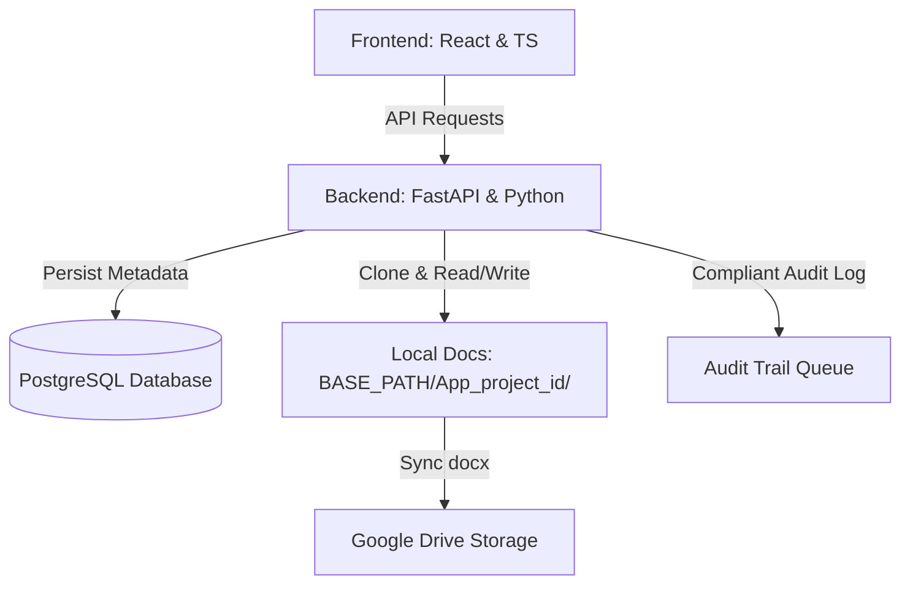
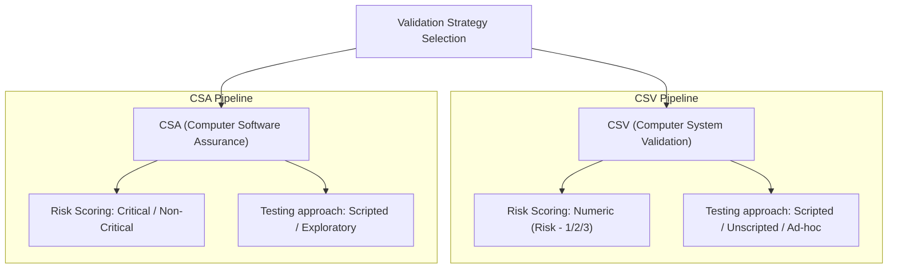

<div align="center">

<h1>
  <picture>
    <source media="(prefers-color-scheme: dark)" srcset="frontend/public/images/logo.png">
    <source media="(prefers-color-scheme: light)" srcset="frontend/public/images/logo.png">
    
  </picture>
  <br>
  ValiSure
</h1>

**ValiSure** is a professional, compliance-first document generation and requirements management platform built specifically for the **Life Sciences, Pharmaceutical, and Medical Device** industries. It automates Computer System Validation (CSV) and Computer Software Assurance (CSA) documentation workflows while ensuring strict compliance with global regulatory standards like **US FDA 21 CFR Part 11** and **EU GMP Annex 11**.


</div>


---

## 🌟 Core Value Propositions

*   **AI-Enhanced Requirement Authoring**: Transforms raw user requirements into formal, auditor-ready *"The system shall..."* specifications automatically.
*   **Dynamic Methodology Switching**: Tailors prompts, risk assessment terminology, and testing approaches dynamically depending on whether a project follows **CSV** or **CSA** guidelines.
*   **Compliant Document Generation**: Direct-writes formatted tables, replaces placeholders (e.g. `<<Software Name and version>>`), and updates revision histories directly inside master `.docx` templates.
*   **Per-Project Isolation**: Organizes project documents inside individual filesystem directories named after the application and project ID (`{AppName}_project_{id}`) to prevent data cross-contamination.
*   **Regulatory Traceability**: Maps user requirements directly to international regulatory clauses (e.g. 21 CFR §11.10(d) for authentication controls).
*   **Alibi Audit Trailing**: Captures full user actions and document modifications to meet electronic signature and security validation expectations.

---

## 🧩 Key Platform Modules & Workflows

### 1. Requirements Lifecycle Control (`Draft` ➔ `Submitted`)
*   **Collaborative Authoring**: Users create requirements in a scratchpad status (`Draft`) where they can run multiple AI iterations to optimize wording.
*   **Validation Freeze**: Once finalized, requirements are promoted to `Submitted`. This triggers a direct write to the project's MS Word document, freezing the requirement configuration for validation reviews.
*   **Safe Renumbering & Sync**: Deleting a requirement triggers sequential renumbering on both `localStorage` and the active `.docx` file (`URS_001`, `URS_002`, ...), keeping the UI and document in perfect order.

### 2. Common Requirements Selector Hub
*   **Global Templates**: A repository of pre-approved, global templates (e.g. general IT security policies, login rules) stored in a shared pool (`URS_CR_xxx`).
*   **Import Engine**: Validation authors can search and select multiple common requirements in a modal to copy them directly into their current project's `.docx` document and DB as `Submitted`.

### 3. File Lock Safeguards & Auto-Recovery
*   **Active Word Locks**: Before modifying any document on the disk, the backend checks for Microsoft Word lock files (`~$*.docx`). If a file is open, the system blocks the update with a clear alert to prevent data corruption.
*   **Self-Healing Templates**: If a document record exists but the `.docx` file is missing, the backend automatically clones a fresh copy of the master template on the next write attempt.

### 4. Compliant Audit Trail (21 CFR §11.10(e))
*   **Full Attribution Logging**: Records user accounts, time stamps, event categories, database transactions, and file mutations.
*   **Audit Middleware**: Intercepts FastAPI routes to trace all database writes and logins, ensuring all actions are logged.

### 5. Access Management & Role Assignment
*   **Role Seeding**: Seeding standard industry permissions (`Admin`, `Validation Lead`, `Author/Editor`, `Reviewer`).
*   **Project-Specific Teams**: Assigns specific users to specific projects with granular roles to preserve data security across business units.

---

## ⚙️ System Architecture & Data Flow



1.  **Authoring / Admin Portal**: React SPA captures project configuration, GAMP categories, methodology, and deliverables.
2.  **FastAPI Compliance Engine**: Validates inputs, coordinates DB records, and manages dynamic AI instructions.
3.  **Document Assembly Service**: Uses `python-docx` to copy templates, populate revision histories, and insert requirement rows with correct sequential numbering (`URS_001`, `URS_002`, ...).
4.  **Google Drive Sync**: Automatically uploads or updates the finalized `.docx` document to the corresponding Google Drive project folder.

---

## 🏛️ Regulatory Coverage Matrix

ValiSure has built-in clause referencing sheets for **6 core standards**:

| Standard | Scope / Focus | Active Clause Mapping in ValiSure |
| :--- | :--- | :--- |
| **21 CFR Part 11** | Electronic Records & Signatures | §11.10(a) Validation, §11.10(d) Access Limits, §11.10(e) Audit Trails, §11.10(g) Role Checks |
| **21 CFR Part 820** | Medical Device Quality Systems | §820.30 Design Controls, §820.40 Document Controls, §820.70 Process Controls |
| **EU GMP Annex 11** | Computerised Systems (Europe) | Clause 1 Risk Management, Clause 4 Validation, Clause 9 Audit Trails |
| **ISO 13485** | Medical Device QMS | §4.2.3 Document Control, §4.2.4 Control of Records, §7.3 Design & Development |
| **21 CFR Part 210** | cGMP Manufacturing General | General manufacturing systems, data accuracy and batch record controls |
| **21 CFR Part 211** | cGMP Finished Pharmaceuticals | Production systems, validation standards for drug product computerized systems |

---

## 🔄 Methodology Switching: CSV vs. CSA

ValiSure dynamically adjusts the generated document terminology and testing criteria based on your project's selected validation strategy:



---

## 📁 Repository Structure

```text
├── backend/                  # Python Fast API compliance server
│   ├── docs/                 # Project-isolated docx folders (gitignored)
│   ├── templates/            # Pristine validation document templates (.docx)
│   ├── venv/                 # Virtual environment
│   ├── python.py             # Main FastAPI routes and Controller class
│   ├── models.py             # SQLAlchemy Postgres models
│   ├── db_config.py          # Centralized Database credentials
│   └── setup_db.py           # Database setup and role seeding script
│
├── frontend/                 # React Single Page Application
│   ├── src/
│   │   ├── pages/            # Project Overview, Dashboard, Bulk URS views
│   │   ├── services/         # Axios API connection endpoints
│   │   └── index.css         # Styling system configuration
│   └── vite.config.ts        # Vite configuration
│
└── README.md                 # Main platform documentation
```

---

## 🚀 Getting Started

### 1. Prerequisites
- **Node.js** (v18.0+)
- **Python** (3.9+)
- **PostgreSQL** Database Instance

### 2. Backend Setup & Run (3 Services)
To support 21 CFR Part 11 compliant audit logging, the backend relies on an asynchronous architecture. You must run **three separate services** simultaneously in separate terminal windows:
#### 1️⃣ Start Redis Broker (Terminal 1)
Redis serves as the task queue broker. Start a Redis server instance:
```bash
# Using Docker (recommended)
docker run -d -p 6380:6380 redis:latest
# Or local Redis Server (make sure to match port 6380 used in db_config)
redis-server --port 6380
```
#### 2️⃣ Run Database Seeding & FastAPI Server (Terminal 2)
1. Navigate to the `backend` directory and activate virtual env:
   ```bash
   cd backend
   # Windows:
   venv\Scripts\activate
   # macOS/Linux:
   source venv/bin/activate
   ```
2. Create your `.env` file from the configuration keys:
   ```env
   DB_HOST=localhost
   DB_PORT=5432
   DB_USER=your_db_user
   DB_PASS=your_db_password
   DB_NAME=valisure_db
   SECRET_KEY=your_secret_key
   REDIS_URL=redis://localhost:6380/0
   ```
3. Install dependencies and run initialization:
   ```bash
   pip install -r requirements.txt
   python setup_db.py
   ```
4. Launch the FastAPI server:
   ```bash
   uvicorn python:app --reload --port 8000
   ```
#### 3️⃣ Start the Celery Worker (Terminal 3)
The worker consumes compliance log tasks from Redis and writes them to the database asynchronously.
1. Open a new terminal, navigate to the `backend` directory, and activate virtual env:
   ```bash
   cd backend
   # Windows:
   venv\Scripts\activate
   # macOS/Linux:
   source venv/bin/activate
   ```
2. Run the Celery worker startup script:
   ```bash
   # Windows (PowerShell):
   .\run_worker.ps1
   # macOS/Linux:
   chmod +x run_worker.sh
   ./run_worker.sh
   ```
*(You can verify the audit engine status by hitting `GET http://localhost:8000/health/audit`)*

### 3. Frontend Installation & Run
1.  Navigate to the `frontend` directory:
    ```bash
    cd frontend
    ```
2.  Install packages:
    ```bash
    npm install
    ```
3.  Launch the Vite development application:
    ```bash
    npm run dev
    ```
4.  Open your browser and navigate to [http://localhost:5173](http://localhost:5173).

---

## 📥 Git Workflow Guidelines

When submitting code changes:
1.  **Verify status and track changes**:
    ```bash
    git status
    ```
2.  **Stage modified files** (temporary files, documents, and `__pycache__` are auto-ignored by the project `.gitignore`):
    ```bash
    git add .
    ```
3.  **Commit with description**:
    ```bash
    git commit -m "Update: Added project-level document isolation and URS table pagination features"
    ```
4.  **Push changes to remote**:
    ```bash
    git push origin main
    ```
